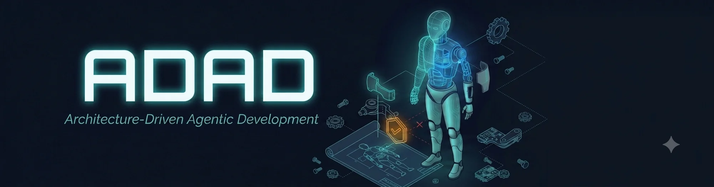

<p align="center">
  
</p>

<p align="center">
  
  
  
  
  
  
</p>

# 📋 ADAD (Architecture-Driven Agentic Development) 開發規範與工具鏈

本專案源自為 **Antigravity AI Agent** 開發的 Workspace Customization 擴充套件，旨在實行 **ADAD (架構驅動型智能體開發)** 開發模式；目前已擴展支援 **Claude Code**、**Codex CLI / 桌面 App** 等其他 Agent 平台，可依需求選擇要套用的一個或多個 Agent。

ADAD 的核心理念是：**將「系統設計（架構）」與「程式碼實作（邏輯）」徹底解耦**。由人類把持高價值的架構與驗收 Checkpoint，並指派 Agent 在最小 Context 的約束下進行高精度的原子程式碼生成，以防範 AI 開發中的架構失控與 Context 膨脹問題。

## ✨ 目前版本：1.6.3

完整版本演進、每次更新的重點與細節，請見 [CHANGELOG.md](CHANGELOG.md)。

## 🧭 為什麼你會需要 ADAD

**模型能力不是決定輸出品質的唯一因素。** 就算換上更強的模型，只要沒有機制約束「架構認知」，AI agent 在多輪修改之後還是會開始亂猜、亂改介面、偷改別人依賴的模組——問題不是模型不夠聰明，是它從頭到尾都沒有一份雙方都要遵守的唯一事實來源可以對照。ADAD 把架構寫成人類與 Agent 共同遵守的合約，用機械化的 pre-commit hook 擋下不合規的變更，而不是寄望 AI 每次都自律。

**架構維持清晰，你不用每次都重新解釋一遍給 Agent 聽。** `system_map.md` 是唯一事實來源，Agent 只讀編譯過的乾淨版本；改一次，全專案的架構認知就同步，不必在每個 prompt 裡重新貼一次背景脈絡。

**大型專案不容易長出結構性 bug。** Draft Debt Ledger 會在某個「先求有再求好」的暫時模組被越來越多地方依賴時，自動要求補齊審查；Domain 邊界檢查用 AST 靜態擋下違規的跨模組 import。架構不會腐化，因為它是被系統結構性擋下來的，不是靠人力盯出來的。

---

## 📐 三層事實流架構 (Three-Layer Facts Flow)

為了將架構演進的「靈活性」與 Agent 生成的「高精準度」完美結合，本專案採用三層事實流設計：

```
    Human Intent
         ↓
  system_map.md          (Architecture Source) ➔ 人類與 Agent 共同設計，支援逐步展開、TODO、決策記錄等
         ↓
      Compile            (compile_map.py)      ➔ 自動進行格式驗證、生命週期狀態繼承與 dirty 判定
         ↓
  system_map.yaml        (Architecture IR)     ➔ 僅供 Agent 讀取上下文與執行工具，禁止人工編輯
         ↓
  Code Generation        (Implementation)      ➔ 依據 YAML (IR) 產生高質量的原子代碼
```

*   **system_map.md (Architecture Source)**：專為人類與 Agent 協同設計的 Markdown 文件。支援 TODO、Checkpoint、Design Decision、Alternative 等內容。允許暫存、未完成與逐步擴充。
*   **system_map.yaml (Architecture IR)**：完全由編譯器（Compiler）從 Markdown 產生的中間表示檔。用途只有 Context 載入、DAG 依賴分析、Rule of Two 正規化檢查與狀態機執行，**嚴禁人工直接編輯**。
*   **過期自動阻斷**：如果 `system_map.md` 的修改時間晚於 `system_map.yaml`，核心引擎將自動阻斷所有查詢指令（如 `read_context.py`）並要求重新編譯，以確保事實一致性。

### Observability Contract

每個 Module 必須明確宣告觀測需求。沒有埋點需求時使用 `- Observability: not_required`；需要觀測時則使用巢狀清單：

```markdown
- Observability:
  - metric: request_latency_ms
  - log: payment_rejected
  - trace: payment_authorization
  - alert: payment_error_rate_high
```

`required` 模式至少要有一項 signal；該契約會寫進 `system_map.yaml`，並隨 Task 快照提供給 coding 端，避免「監控回饋」只停留在文件口號。

### 可執行 Invariants 與 Verification

Invariants 除了 `deny_imports`，也可禁止特定呼叫：

```markdown
- Invariants:
  - deny_imports: [subprocess]
  - deny_calls: [eval, subprocess.run]
```

Verification case 支援正常回傳與預期例外兩種驗收：

```markdown
- Verification:
  - case: {"input": {"x": 2}, "expect": 4}
  - case: {"input": {"x": -1}, "expect_exception": "ValueError"}
```

CLI 或 migration 使用 `command`／`integration_case`：

```markdown
- Verification:
  - command: {"argv": ["{python}", "{source}", "--check"], "expect_exit": "nonzero", "timeout": 30}
  - integration_case: {"fixtures": [{"source": "tests/fixture.db", "target": "db/test.db"}], "steps": [{"argv": ["{python}", "{source}", "--apply", "--db", "{workspace}/db/test.db"], "timeout": 30}]}
```

命令以 argv 與 `shell=False` 在隔離暫存工作區執行；每個 `command` 與 integration step 都必須明確設定 1–300 秒的 `timeout`，任一步驟失敗即停止。所有規則皆由 AST／執行期驗證器機械檢查，失敗會阻擋 Task 提交。

### 架構文件與 Task 快照的責任邊界

`system_map.md`／`system_map.yaml` 是可長期演進的架構事實；`.agents/tasks/<node>.task.json` 則是針對單次施工核發、帶有 `source_hash` 的凍結快照。Task 格式由根目錄的 [task_schema.json](task_schema.json) 定義，內含 schema version、任務狀態、目標模組契約與相依介面。核發、提交、核准／駁回與工具 Gate 都會驗證其完整性；格式遭破壞的快照會被拒絕，而不是被當成架構文件重新解讀。

Task 預設採 `preserve_diff` rollback 策略：驗證失敗或人工駁回時，ADAD **不會自動 reset 或刪除實作檔**。它會保留工作區差異，並記錄施工前與駁回時的檔案 hash，讓人類決定保留、修正或另行回復，避免自動清理造成未保存工作的損失。

同一個來源檔一次只會核發一個開放 Task。核發時會以原子 `.agents/tasks/.source_locks/` 鎖定來源檔；其他 Module 即使綁定同檔不同函式，也會得到可讀的 `[SOURCE LOCK]` 衝突資訊。鎖會跨 `assigned`、`in_progress` 與 `submitted` 狀態持續保留，僅在 CP-2 核准後釋放；駁回則保留給原 Task 修正，避免平行施工互相覆蓋。

---

## 📂 專案目錄結構

> 👉 下方的 `pyproject.toml` 就是 **`pip install .` 指令要認的那個檔案**。
> 只要你所在的資料夾能看到這個檔案，代表這裡就是本 repo 根目錄，
> 也就是應該執行 `pip install .` 的位置。

```
ADAD/                # ← repo 根目錄，pip install . 要在這裡執行
├── adad_cli/                      # `adad` CLI 套件原始碼（pip install . 實際安裝的內容）
│   ├── cli.py                     # 指令定義 (adad init / remove / global / pack)
│   ├── core.py                    # 對應每個指令的實際邏輯
│   ├── resources.py               # 定位套件內建範本檔（不依賴使用者執行指令當下的 cwd）
│   └── resources/                 # 內建資產：agents/、templates/ 與 blocked_report MCP/文字 fallback
├── pyproject.toml                 # 套件設定：定義了 `adad` 這個可執行指令 (project.scripts)
├── install.py                     # [已棄用] 舊版進入點，轉發呼叫到 adad_cli，保留相容性
├── .agents/                       # 本 repo 自身開發時使用的 Workspace Customizations
│   ├── AGENTS.md                  # Antigravity Rules (定義四大全局規則與 CP 決策限制)
│   └── skills/
│       └── adad-workflow/         # ADAD 輔助工具技能（與 adad_cli/resources/agents 內容一致）
│           ├── SKILL.md           # Skill 定義與 Antigravity 調用引導
│           └── scripts/           # Antigravity 藉由 run_command 執行的輔助 Python 腳本
│               ├── adad_core.py   # 核心引擎 (Markdown 解析、IR 讀寫、DAG 分析、過期阻斷)
│               ├── compile_map.py # Architecture Compiler (Markdown ➔ YAML 狀態合併 + Draft Debt 偵測)
│               ├── resume_analysis.py # Resume 分析器 (進度統計、智能下一步建議、Draft Debt Ledger)
│               ├── adad_pre_commit.py # Pre-Commit Hook (機械強制 RULE-01/02/03 + Invariants + Verification)
│               ├── read_context.py
│               ├── check_normalization.py
│               ├── analyze_cascade.py
│               ├── transit_state.py
│               ├── verify_implementation.py # 實作校驗器 (驗證 Verification 條件如斷言)
│               └── check_invariants.py # Invariants 校驗器 (驗證靜態 AST 導入約束)
├── checkpoints/                   # Checkpoint 決策歷史存檔目錄 (CP-X-XXX.yaml)
├── system_map.md                  # 專案架構唯一事實來源 (SSOT - Architecture Source)
├── system_map.yaml                # 專案架構中間表示檔 (SSOT - Architecture IR)
└── README.md                      # 本說明文件
```

> 💡 `.agents/` 是這個 repo「自己開發自己」時用的 ADAD 專案結構（dogfooding）；
> `adad_cli/resources/agents/` 則是**打包進 `adad` 套件、會被複製到其他專案**的版本。
> 兩者內容一致，只是用途不同——一個是「本 repo 自舉」，一個是「發佈給別人用」。

---
## 🚀 快速上手

### 步驟 0：安裝 `adad` 命令列工具（只需做一次）

> ⚠️ **`pip install .` 一定要在「這個 repo 的根目錄」（也就是 `pyproject.toml` 所在的那一層）
> 執行，`.` 才會正確代表「目前這個資料夾」。**
> 如果在別的地方（例如你自己的專案目錄、或 repo 外層）執行 `pip install .`，
> pip 會去讀「你當下所在資料夾」的 `pyproject.toml`，通常會直接報錯找不到檔案，
> 或裝到完全不相干的東西。

```bash
git clone <repo-url>
cd ADAD                  # 進入本 repo 根目錄——這裡要能看到 pyproject.toml
ls pyproject.toml         # (可省略) 確認自己站對位置，能看到檔案就代表位置正確
pip install .             # 只在這裡執行一次；或用 pipx install . 取得獨立、不污染全域 site-packages 的安裝
```

`pip install .` 中的 `.` 代表「安裝目前這個目錄底下的套件」，pip 會依照這裡的
`pyproject.toml` 把 `adad_cli/` 打包安裝，並在你的 Python 環境（或 venv）的
`bin/`（Windows 為 `Scripts/`）目錄下產生一個 `adad` 可執行檔。

安裝完成後，PATH 上就有了這個真正的 `adad` 指令，**之後可以離開這個 repo，
在任何其他專案目錄下**直接使用 `adad <子指令>`（例如 `adad init`），不需要再記得
`install.py` 放在哪裡、也不需要 `cd` 回這個 repo。

若想確認安裝與 PATH 是否正確，可以執行：
```bash
adad --version
```
如果出現 `command not found: adad`，通常代表 pip 安裝套件的 `bin/`（例如
`~/.local/bin` 或你目前啟用的 venv 的 `bin/`）不在 PATH 裡，需要自行加入，
或改用 `pipx install .`（pipx 會自動處理 PATH 設定）。

若之後修改了 `adad_cli/` 原始碼想立即生效，可改用可編輯模式安裝：
```bash
pip install -e .
```
差別在於 `-e`（editable）安裝後，指令會直接讀取 repo 裡的原始碼，
改完程式碼不用重新 `pip install` 就能測到最新行為，適合開發這個工具本身時使用。

### 步驟 1（必要）：在每個目標專案執行 `adad init`

> ⚠️ **這一步不是「選項之一」，是啟用 ADAD 安全機制的唯一入口。**
> `pip install .`／`pipx install .` 只是把 `adad` 這個指令裝進你的電腦，
> **並不會**對任何專案做任何事。真正把 pre-commit hook 寫進
> `.git/hooks/pre-commit`、建立 `checkpoints/`、`system_map.md` 等安全防線的，
> 是 `adad init`。**沒有對某個專案執行過 `adad init`，那個專案就完全沒有
> ADAD 的機械強制保護**——即使你已經執行過 `adad global install` 也一樣，
> 因為全域安裝影響的是「Agent（Antigravity IDE、Claude Code 或 Codex）認不認得這個 skill」，
> 跟「這個專案有沒有裝上 pre-commit hook」是兩件互不相關的事。

1. `cd` 到**任何**想套用 ADAD 架構的專案根目錄（必須已經是 `git init` 過的 repo，
   pre-commit hook 才裝得上去），執行：
   ```bash
   adad init
   ```
   不加 `--agents` 參數時，會跳出互動選單詢問要為哪些 Agent 設定 ADAD（可複選）：

   ```
   要為哪些 Agent 設定 ADAD？（可複選，Enter 採用預設值 y）
     antigravity — Antigravity 2.0 / IDE (Gemini)？ [Y/n]
     claude      — Claude Code？ [Y/n]
     codex       — Codex CLI / 桌面 App？ [Y/n]
   ```

   也可以用 `--agents` 直接指定、跳過互動選單，例如只設定 Claude Code：
   ```bash
   adad init --agents claude
   ```
   或同時設定三者：
   ```bash
   adad init --agents antigravity,claude,codex
   ```

   這會建立 `checkpoints/`、`docs/adr`、`docs/patterns`、`system_map.md`（並自動編譯出
   `system_map.yaml`）、`.venv/`、`.git/hooks/pre-commit`，**並把 `adad-workflow` skill 的腳本
   複製一份到該專案的 `.agents/skills/adad-workflow/`**，讓這個專案完全自我完備，不必依賴
   全域安裝也能運作。若選擇了 `claude`，還會額外：
   - 把 `adad-workflow` skill 複製一份到 `.claude/skills/adad-workflow/`，讓 Claude Code 的
     Project Skills 機制能自動發現（Claude Code 讀 `.claude/skills/<name>/SKILL.md`）；
   - 在專案根目錄的 `CLAUDE.md` 開頭補上一行 `@.agents/AGENTS.md` 匯入既有規則檔
     （若 `CLAUDE.md` 不存在會自動建立；若已存在，只新增匯入這一行，不覆蓋你原本的內容）；
   - 在專案的 `.claude/settings.json` 自動註冊 PreToolUse gate（`adad_pretooluse_gate.py`），
     讓 Claude Code 在真正動手改代碼**之前**就攔截違反狀態門禁的修改，比 pre-commit hook
     更早擋下，省下已經寫出來又要丟棄的 token；若 `settings.json` 已存在其他設定，只會
     新增這一條，不會動到你原本的內容。hook command 固定使用該專案 `.venv` 的 Python，
     並依 Windows／POSIX 規則安全引用路徑；`adad upgrade` 會更新舊版 `python3` 命令，若
     `settings.json` 不是合法 JSON 則保留原檔並明確回報，不會覆寫損壞內容。

   若選擇了 `codex`，則會：
   - **不需要**複製 skill——Codex CLI / 桌面 App 原生就會掃描 `.agents/skills/`，
     跟 ADAD 既有的專案結構完全相同；
   - 在專案根目錄建立一個 `AGENTS.md` → `.agents/AGENTS.md` 的 **symlink**。因為 Codex 讀取
     `AGENTS.md` 是「由上而下逐層合併」（全域 `~/.codex/AGENTS.md` → repo 根目錄 `AGENTS.md`
     → 子目錄 `AGENTS.md`），讀的是 repo 根目錄那份，用 symlink 讓兩邊內容自動保持一致，
     不需要手動同步兩份檔案。若根目錄已經有你自己的 `AGENTS.md`（不是 ADAD 建立的 symlink），
     ADAD 不會覆蓋它，只會印出提醒；若環境不支援建立 symlink（常見於 Windows 未開啟開發者
     模式／沒有系統管理員權限），會 fallback 改成直接複製檔案，並提醒這份副本之後不會自動
     跟著 `.agents/AGENTS.md` 同步，需要重新執行 `adad upgrade` 手動確認。

   選擇的結果會記錄在 `.agents/.adad-agents.json`，之後執行 `adad upgrade` 會自動讀取這份
   紀錄、不需要重新選一次。
2. 安裝 Python 依賴：
   ```bash
   .venv/bin/pip install -r requirements.txt   # Windows: .venv\Scripts\pip install -r requirements.txt
   ```
3. 完成後即可呼叫 ADAD 底層腳本，例如：
   ```bash
   .venv/bin/python .agents/skills/adad-workflow/scripts/read_context.py <node_name>
   ```
4. 不再需要 ADAD 時，於該專案目錄執行 `adad remove` 即可還原（移除 `.venv`、pre-commit hook、
   本地 skill 副本）。**`system_map.md`／`system_map.yaml`／`checkpoints/` 這些是你自己的
   架構文件與決策紀錄，預設會保留、不會被刪除**；如果確定要連同這些也一起清掉重來，
   改執行 `adad remove --purge-docs`。

### 步驟 2（可選加碼）：全域安裝至 Antigravity / Claude Code / Codex

`adad init` 每個專案都要各自執行一次，這件事不會因為做了下面這步而改變。
這步純粹是**額外的便利功能**：讓 Antigravity IDE 或 Claude Code 在任何專案裡都能直接看到
讓 Antigravity IDE、Claude Code 或 Codex 在任何專案裡都能直接看到
ADAD 的 skill 說明與規則，不用等到 `adad init` 之後才看得到。

```bash
adad global install
```

同樣不加 `--agents` 會跳出互動選單；也可以直接指定，例如只對 Codex 全域安裝：
```bash
adad global install --agents codex
```

*   選擇 `antigravity`：會將 `adad-workflow` Skills 複製到所有已知 Antigravity 全域路徑，
    並將 ADAD 規則寫入 `~/.gemini/GEMINI.md`。
*   選擇 `claude`：會將 `adad-workflow` Skills 複製到 `~/.claude/skills/`，並將 ADAD 規則
    寫入 `~/.claude/CLAUDE.md`。安裝完成後，開一個新的 Claude Code session，
    問它「你現在有哪些 skills 可以用」即可確認載入成功。
*   選擇 `codex`：會將 `adad-workflow` Skills 複製到 `~/.agents/skills/`（Codex CLI 的
    全域個人路徑）與 `~/.codex/skills/`（Codex 桌面 App 記載的全域路徑），並將 ADAD 規則
    寫入 `~/.codex/AGENTS.md`。安裝完成後，同樣建議開新 session 詢問 Codex 目前有哪些
    skill／規則可用，以確認已被讀到。

若要移除，執行 `adad global uninstall`（同樣支援 `--agents` 指定要卸載的 Agent，
省略則卸載全部已知 Agent）。

> 💡 **不想全域安裝？** 完全沒問題，直接跳過這步即可。`adad init` 本身就會把
> skill 腳本複製一份到目標專案內（自我完備），不依賴全域安裝也能正常運作。
> 這個決定跟「要不要 clone 專案進某個地方」無關——你只需要 `pip install .` 過
> 一次（見上方步驟 0），之後在任何電腦上的任何專案都可以直接 `adad init`，
> 不需要把 ADAD 這個 repo 本身 clone 或複製進每一個目標專案裡。
>
> （如果你希望完全不影響全域 Python 環境，正確做法是在**目標專案自己的
> `.venv` 裡**執行 `pip install /path/to/adad-cli`，而不是把 ADAD 的原始碼
> clone 進目標專案資料夾——後者會讓目標專案的 git 裡多出一個巢狀的
> `.git`，追蹤起來會很混亂，不建議這樣做。）

### 步驟 3（之後有新版套件時）：升級已經 init 過的舊專案

`pip install` 升級了套件本身（例如修了 pre-commit hook 的 bug），**不會自動反映到
之前已經 `adad init` 過的專案**——因為那些檔案在當時就已經複製進該專案裡了。
想同步最新版本，到該專案目錄執行：

```bash
adad upgrade
```

只會更新套件管理的檔案（`adad-workflow` 腳本、pre-commit hook），覆蓋前自動備份成
`.bak`；`system_map.md`、`checkpoints/`、`docs/adr`、`docs/patterns` 等你自己的資產
完全不會被觸碰，`.agents/AGENTS.md` 若偵測到你客製化過也只會提示、不會自動覆蓋
（要強制覆蓋才需要加 `--force-agents-md`）。
記得提醒你的agent套件已更新，不然他還會載入舊的上下文。


### 常用指令一覽

| 指令 | 說明 |
|---|---|
| `adad init` | 在目前專案初始化 ADAD（自我完備，含本地 skill 副本）；不加 `--agents` 會跳互動選單詢問要設定 antigravity / claude / codex 中的哪些 |
| `adad init --agents claude` | 同上，但只為 Claude Code 設定（跳過互動選單），可用逗號指定多個，如 `antigravity,claude,codex` |
| `adad init --agents codex` | 同上，但只為 Codex 設定：不複製 skill（原生共用 `.agents/skills/`），改為建立根目錄 `AGENTS.md` symlink |
| `adad upgrade` | 將已安裝的套件版本安全同步到已 init 過的專案（讀取當初 `adad init` 記錄的 Agent 清單；僅更新套件管理的檔案，不動使用者資產；覆蓋前自動備份成 `.bak`） |
| `adad upgrade --force-agents-md` | 同上，但連 `.agents/AGENTS.md` 也用套件最新版本強制覆蓋 |
| `adad remove` | 清理/還原目前專案的環境與工具產出（受管理的 `.venv`、pre-commit hook、本地 skill 副本，含 `.claude/skills/adad-workflow`、Codex 用的根目錄 `AGENTS.md` symlink、`.claude/settings.json` 裡的 PreToolUse gate 設定）；舊版 `venv/` 只提示、不自動刪除；`system_map.md/.yaml`、`checkpoints/` 等使用者資產預設保留 |
| `adad remove --purge-docs` | 同上，但連同 `system_map.md/.yaml`、`checkpoints/` 一併刪除 |
| `adad global install` | 部署到 Antigravity／Claude Code／Codex 全域設定，供所有專案共用；不加 `--agents` 會跳互動選單 |
| `adad global uninstall` | 自 Antigravity／Claude Code／Codex 全域設定移除；可用 `--agents` 指定，省略則卸載全部已知 Agent |
| `adad pack` | 打包目前目錄的 `.agents`（與 `.claude`，若存在）為 zip，供發布用 |
| `adad --version` / `adad --help` | 查看版本 / 說明 |

> 舊版 `python install.py <cmd>` 仍保留作為相容轉發（`init`→`init`、`clean`→`remove`、
> `global`→`global install`、`uninstall`→`global uninstall`），但建議直接改用 `adad`。

## 🛡️ 核心開發憲法 (Global Rules)

不論 Agent 執行哪一個階段的任務，都必須強制遵循以下元規則（Meta-Rules）：

> *   **[RULE-01] SSOT 唯一性** 🔒 **機器強制**：你唯一的記憶與事實來源為 `system_map.yaml` (自 `system_map.md` 編譯而來)。**嚴禁自行在代碼中衍生或假設未記載於該檔案的介面、路由或規格。** Pre-commit hook 自動阻斷過期的 `system_map.yaml`。
> *   **[RULE-02] 先架構後程式 (拒絕 Code-First)** 🔒 **機器強制**：嚴禁 Code-First 開發。只有在目標節點於 `system_map.yaml` 中的狀態為 `planned`、`dirty`、`validated`、`draft` 或 `pending_review`，且已通過人類的 Checkpoint 審核時，你才被允許生成或修改該節點的商業邏輯代碼。Pre-commit hook 比對 staged 檔案與模組狀態。
> *   **[RULE-03] 原子化操作 (Atomic Scope)** ⚠️ **機器警告**：你每次的輸出（程式碼修改）**只能影響單一節點（單一函數、API 或組件）**。嚴禁進行跨模組、跨檔案的大規模 Patch 程式碼。Pre-commit hook 偵測跨模組修改時發出 WARNING。
> *   **[RULE-04] 遇錯即停 (Fail-Fast)** 📝 **Agent 行為規則**：在 Phase 2（實作期）若發現架構規格無法滿足邏輯需求（例如：發現少傳引數、需要多回傳欄位等），**你必須立即中斷程式碼生成**，改為輸出 `Schema Update Request` 格式，並等待人類審核。

---

## ⚠️ 機械強制的前提與已知限制

上面所有標示「🔒 機器強制」的規則，**實際上都是靠 `.git/hooks/pre-commit` 這支 hook 執行的**。這代表兩件事，務必知道：

1. **hook 沒裝，強制就完全不存在。** 只有執行過 `python install.py init` 才會裝上這支 hook。如果團隊裡有人是直接 `git clone` 專案就開始改東西、沒跑過 `init`，RULE-01~05、Invariants、Verification 全部都不會生效——而且**系統不會主動告訴你這件事**，一切看起來都跟正常一樣，只是完全沒人在把關。
   為了降低這個風險，`compile_map.py` 與 `resume_analysis.py` 現在會在每次執行時主動檢查：若偵測到目前是 git repo、但 `.git/hooks/pre-commit` 不存在，會印出 `[NO GUARDRAIL]` 警告，提醒你尚未安裝 hook。但這只是被動提醒，不會阻止任何操作。

2. **`git commit --no-verify` 可以完全繞過 pre-commit hook，不留任何痕跡。** 這是 git 本身的機制，ADAD 無法從 hook 層面阻止。**強烈建議在 CI/CD pipeline 中額外執行一次**：
   ```bash
   python .agents/skills/adad-workflow/scripts/adad_pre_commit.py
   ```
   把它當作本地 hook 被跳過時的最後一道防線。`adad_pre_commit.py` 本身是讀 git 的 staged/HEAD 內容執行檢查，跟本地 hook 用的是同一份邏輯，可以直接搬進任何 CI 環境使用。

3. **效能：目前不呼叫任何 LLM，純靜態分析（AST + regex + YAML），但會隨專案規模變慢，實測數字如下。**
   `adad_pre_commit.py` 完全是本機同步執行的靜態檢查，沒有網路請求、沒有呼叫任何語言模型 API——這代表它的延遲上限是「跟專案規模成正比的本機運算」，不是不可預期的網路/推論延遲。實際量測：
   - 小型專案（4 個模組）：約 0.07 秒，跟一般 Linter 感覺不出差異。
   - 中型規模（2000 個模組、單次 commit 觸及 50 個檔案）：修正前（每個 staged 檔案都重新載入一次整份 `system_map.yaml`）要 **69.5 秒**；修正後（`system_map.yaml` 只載入一次、所有檔案共用）降到 **2.3 秒**。
   若你的專案模組數持續成長、單次 commit 又常常一次觸及大量檔案，2 秒左右的等待仍然存在——這是目前架構下（YAML 反序列化 + 逐檔 AST 解析）的合理下限，不是零成本。若這個等待時間開始造成困擾，建議把非阻斷性的檢查（如孤兒地圖偵測）搬到 CI 而非本地 hook，只在本地保留真正需要即時回饋的幾條規則。

4. **同時使用 Claude Code 與 Codex 時，Codex 桌面 App 可能會自動改寫 skill 內容。** 據社群回報，Codex 桌面 App 偵測到專案內有 `.claude/skills/` 時，會自動把內容複製一份到 `.agents/skills/`，並把其中「Claude Code」等字串取代成「Codex」。這代表如果你的專案同時勾選了 `claude` 與 `codex` 兩個 agent，事後可能會發現 `.agents/skills/adad-workflow/` 底下的內容被改動過。目前建議：若同時使用兩者，執行完 `adad init` 或 `adad upgrade` 後，可用 `git diff` 確認 `.agents/skills/` 底下有沒有非預期的變更，必要時重新執行一次 `adad upgrade` 復原。

5. **PreToolUse gate 只覆蓋狀態門禁，不覆蓋「有沒有先讀 context / 呈報計畫」。** `.claude/settings.json` 裡自動註冊的 `adad_pretooluse_gate.py`（見「ADAD 核心 CLI 工具說明」）能在 Agent 真正動手改代碼**之前**擋下狀態不允許的修改，但只要模組狀態本身允許修改（`planned`/`draft`/`dirty`/`validated` 都算），Agent 仍然可以不呼叫 `read_context.py`、不呈報 Checkpoint 2 計畫就直接生成程式碼——此門禁機制目前無法主動攔截。換句話說，這解決的是「明知故犯的狀態違規」，不是「跳過計畫呈報」，後者仍需搭配 SKILL.md 的行為規範與人類自己的 code review 習慣。

---

## 🔄 ADAD 核心 CLI 工具說明

當前專案底下設定的 Agent（Antigravity、Claude Code 或 Codex）可以直接調用以下指令來操作架構狀態：

| 工具腳本 | 功能說明 | 調用時機 |
| :--- | :--- | :--- |
| `compile_map.py` | 編譯 `system_map.md` ➔ `system_map.yaml` + Draft Debt / 模組落點偵測 | 修改 Markdown 架構源後應優先執行 |
| `resolve_target_file.py` | 查詢新模組該寫進哪個實體檔案（含子地圖落點） | Phase 1 新增模組前，先查再動筆 |
| `resume_analysis.py` | 分析架構進度、Draft Debt Ledger 與智能推薦下一步 | 開發重啟、或人類要求進度概覽時執行 |
| `generate_task.py` | 核發單一模組的凍結快照，鎖定 source 檔案，建立明確合約 | Phase 2 開發前核發 Task |
| `read_context.py` | 讀取單一節點即將匯出給 Task 快照的完整內容（spec、Invariants、Verification 等） | Phase 1 核准 CP-1 之後、執行 `generate_task.py` 之前，即時確認一次匯出內容是否正確；Phase 2 coding 端不應再直接呼叫本腳本 |

```
[ Phase 1: 架構規劃 ]
  1. 人類或 Agent 在 `system_map.md` 新增／修改模組節點（Description、Interface、Invariants、Verification 等）。
  2. Agent 執行 `compile_map.py`，將 `system_map.md` 編譯為 `system_map.yaml`，同時偵測 Draft Debt 與模組落點。
  3. Agent 執行 `resolve_target_file.py`，確認新模組該落在哪個實體檔案（含子地圖落點）。
  4. 🚧 【人工 Checkpoint 1】：人類審查架構規劃（Domain、Interface、Invariants），核准後模組狀態才允許進入 Phase 2。
       │
       ▼
[ Phase 2: 原子生成 ]
  5. Agent 執行 `generate_task.py`，核發該模組的凍結快照（Task snapshot）並鎖定 source 檔案。
  6. Agent 讀取 Task 快照的 `spec` 欄位取得完整上下文並開始編寫程式碼——不再直接呼叫 `read_context.py` 或讀取 `system_map.yaml`。
  7. Agent 呼叫 `check_domain_boundary.py`，確認新增／修改的依賴沒有跨越不允許的 Domain 邊界。
  8. Agent 執行 Lint & Type Check 驗證代碼。
  9. Agent 呼叫 `check_invariants` 與 `verify_implementation` 進行架構與自檢約束校驗。
     ├── ❌ 失敗：系統呼叫 Agent 讀取 Error，進入自我修正循環 (Self-Fix Loop)。
     └──  成功：Agent 呼叫 `adad_task.py submit` 提報任務（狀態變為 submitted）。
  10. 🚧 【人工 Checkpoint 2】：人類審查產生的程式碼與實作，確認無誤後執行 `adad_task.py approve` 批准，解除 source 鎖定，推進模組狀態為 [deployed]。若駁回則執行 `adad_task.py reject`，保留檔案變更供後續修正。
       │
       ▼
[ Phase 3: 反向同步 ] ─── (若 Agent 在 Phase 2 實作期發現架構缺陷...)
  11. Agent 中斷程式碼生成，改為輸出 `Schema Update Request` 提案給人類。
  12. 🚧 【人工 Checkpoint 3】：人類審查此架構更新請求與影響範圍。
  13. 人類批准更新後，系統執行 Version +1，並自動呼叫 `analyze_cascade`。
  14. 系統自動將變更節點及所有受其影響的上層依賴節點狀態標記為 [dirty]。
  15. 🔄 人類引導開發流程重回 [Phase 2]，重新呼叫 Agent 生成所有被標記為 dirty 的節點。
       │
       ▼
[ Phase 4: 執行回饋 ]
  16. 人類部署運行系統，並收集監控工具或測試回報數據。
  17. 人類呼叫 Agent 分析運行數據，Agent 輸出 `suggest_architecture_update` 優化提案。
  18. 🚧 【人工 Checkpoint 4】：人類審查並評估此優化提案，批准後更新 YAML，受影響節點變更為 [dirty]，人類重啟 [Phase 2] 演進。
```

---

## 🚧 Checkpoint Review Payload 標準格式

每個 Checkpoint 由三個部分組成：**系統呈現給人類的內容**、**人類的決策選項**、**決策後系統的行為**。每個 Checkpoint 無論結果如何，完整 Payload 都必須存檔於 `checkpoints/CP-{phase}-{序號}-{approved|rejected|modified}.yaml`。

ADAD 定義了 4 種 Checkpoint（架構規劃、環境部署規劃、原子模組審查、Schema Update / 架構優化提案），每一種的完整 YAML payload 格式、共用信封格式，以及跨 Checkpoint 的共用規則與自修復限制，都整理在獨立文件：

👉 [docs/specifications/07_checkpoint_payload_format.md](docs/specifications/07_checkpoint_payload_format.md)

## 📈 版本演進與改善紀錄

詳細的版本演進、功能改善以及歷史變更紀錄，請參閱專案根目錄下的 [CHANGELOG.md](CHANGELOG.md)。

## 🙏 致謝與開發方式說明

本專案的架構設計、開發規範與所有 Checkpoint 決策由專案作者主導，開發過程中使用 AI 協作開發（由人類把持架構與審核，Agent 負責原子程式碼生成，詳見上方 ADAD 工作流）。

部分模組在實作與除錯階段，另外搭配了 **[ponytail](https://github.com/DietrichGebert/ponytail)** 這個 skill 協助控制程式碼精簡度、避免過度工程化（YAGNI 導向）。程式碼中部分 `ponytail:` / `ponytail-fix:` 開頭的註解，即為此工具留下的痕跡，特此註明並感謝原作者 [DietrichGebert](https://github.com/DietrichGebert) 的開源分享。
