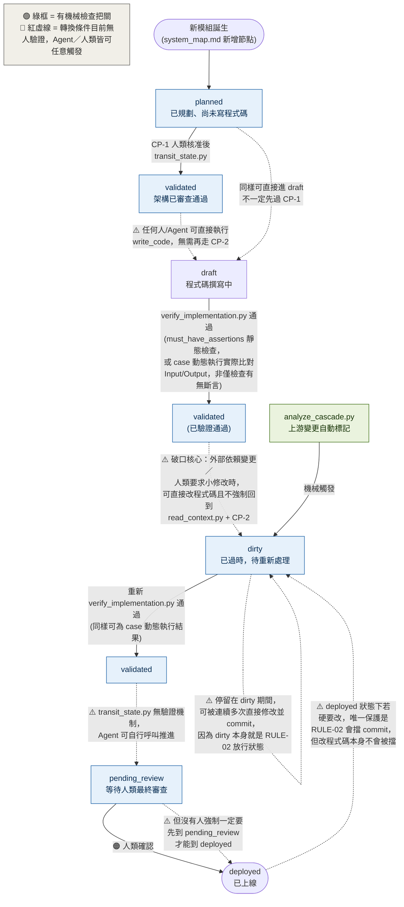

```mermaid
flowchart TD
    Legend["🟢 綠框 = 有機械檢查把關<br/>🔴 紅虛線 = 轉換條件目前無人驗證，Agent／人類皆可任意觸發"]

    New(["新模組誕生<br/>(system_map.md 新增節點)"]) --> Planned["planned<br/>已規劃、尚未寫程式碼"]

    Planned -->|"CP-1 人類核准後<br/>transit_state.py"| Validated["validated<br/>架構已審查通過"]

    Validated -.->|"⚠️ 任何人/Agent 可直接執行<br/>write_code，無需再走 CP-2"| Draft["draft<br/>程式碼撰寫中"]
    Planned -.->|"同樣可直接進 draft<br/>不一定先過 CP-1"| Draft

    Draft -->|"verify_implementation.py 通過<br/>(must_have_assertions 靜態檢查，<br/>或 case 動態執行實際比對<br/>Input/Output，非僅檢查有無斷言)"| Validated2["validated<br/>(已驗證通過)"]

    Validated2 -.->|"⚠️ 破口核心：外部依賴變更／<br/>人類要求小修改時，<br/>可直接改程式碼且不強制回到<br/>read_context.py + CP-2"| Dirty["dirty<br/>已過時，待重新處理"]

    Cascade["analyze_cascade.py<br/>上游變更自動標記"] -->|"機械觸發"| Dirty

    Dirty -.->|"⚠️ 停留在 dirty 期間，<br/>可被連續多次直接修改並 commit，<br/>因為 dirty 本身就是 RULE-02 放行狀態"| Dirty

    Dirty -->|"重新 verify_implementation.py 通過<br/>(同樣可為 case 動態執行結果)"| Validated3["validated"]

    Validated3 -.->|"⚠️ transit_state.py 無驗證機制，<br/>Agent 可自行呼叫推進"| PendingReview["pending_review<br/>等待人類最終審查"]

    PendingReview -->|"🟠 人類確認"| Deployed(["deployed<br/>已上線"])
    PendingReview -.->|"⚠️ 但沒有人強制一定要<br/>先到 pending_review<br/>才能到 deployed"| Deployed

    Deployed -.->|"⚠️ deployed 狀態下若<br/>硬要改，唯一保護是<br/>RULE-02 會擋 commit，<br/>但改程式碼本身不會被擋"| Dirty

    classDef gate fill:#eaf3de,stroke:#3b6d11,stroke-width:1px,color:#173404;
    classDef gap fill:#fceded,stroke:#e24b4a,stroke-width:1px,color:#791f1f;
    classDef human fill:#faeeda,stroke:#854f0b,stroke-width:1px,color:#412402;
    classDef legend fill:#f1efe8,stroke:#5f5e5a,stroke-width:1px,color:#2c2c2a;
    classDef state fill:#e6f1fb,stroke:#185fa5,stroke-width:1px,color:#042c53;

    class Legend legend;
    class Planned,Validated,Validated2,Validated3,Dirty,PendingReview state;
    class Cascade gate;

```
