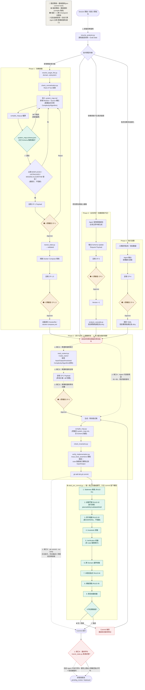

```mermaid
flowchart TD
    Legend["🔵 藍底實線 = 機械強制(pre-commit hook)<br/>🟢 綠底實線 = 機械強制(compile 階段)<br/>🟠 橘底 = 人類 Checkpoint 決策點<br/>🔴 紅底虛線箭頭 = 目前只靠 Agent 自律,無機械強制(破口)"]

    Start(["Session 開始 / 收到人類指令"]) -.->|"⚠️ 建議但無強制"| Resume["resume_analysis.py<br/>讀取進度快照 + Draft Debt"]
    Resume --> Route{"指令類型判斷"}

    Route -->|"新增模組/新功能"| A1
    Route -->|"修改既有模組小邏輯"| P2Entry
    Route -->|"架構規格不足/需求變更"| C1
    Route -->|"監控回饋/效能優化"| D1

    subgraph P1["Phase 1：架構規劃"]
        A1["resolve_target_file.py<br/>domain, subsystem"] --> A2["check_normalization.py<br/>Rule of Two 查重"]
        A2 --> A3["寫入 system_map.md<br/>新增 Module + Source 欄位<br/>(複雜函式另填 Complexity/Algorithm)"]
        A3 --> A4["compile_map.py 編譯"]
        A4 --> A4S{"system_map.schema.json<br/>正式 Schema 驗證通過?"}
        A4S -->|"❌ 不通過<br/>(阻斷編譯)"| A3
        A4S -->|"✅ 通過"| A5{"出現 MISPLACED / UNTRACKED /<br/>MISSING ALGORITHM 警告?<br/>(僅提示，不阻斷)"}
        A5 -->|"有"| A3
        A5 -->|"無"| A6["呈報 CP-1 Payload"]
        A6 --> A7{"🟠 人類審查 CP-1"}
        A7 -->|"Reject"| A3
        A7 -->|"Approve"| A8["transit_state.py<br/>→ validated"]
        A8 --> A9["規劃 Docker Compose 環境"]
        A9 --> A10["呈報 CP-1.5"]
        A10 --> A11{"🟠 人類審查 CP-1.5"}
        A11 -->|"Approve"| A12["自動產生 Dockerfile /<br/>docker-compose.yml"]
    end
    A12 --> P2Entry

    subgraph P2["Phase 2：原子生成／小邏輯修改　⚠️ 本次要加強的環節"]
        P2Entry(["收到針對既有模組的修改指令"]) -.->|"⚠️ 破口1：無機制強制執行"| B1["read_context.py &lt;node_name&gt;<br/>取得 Input/Output/Invariants/<br/>Complexity/Algorithm(若有)"]
        B1 -.->|"⚠️ 破口2：無機制強制呈報"| B2["呈報 CP-2 Payload<br/>(修改計畫 / diff 預覽)"]
        B2 -.->|"⚠️ 破口3：無機制強制等待回覆"| B3{"🟠 人類審查 CP-2"}
        P2Entry -.->|"⚠️ 破口4：Agent 可直接跳過<br/>B1~B3，憑記憶直接改"| B4
        B3 -->|"Approve"| B4["生成／修改程式碼"]
        B4 --> B5["compile_map.py<br/>(若動到 system_map.md，<br/>含 Schema 驗證)"]
        B5 --> B6["check_invariants.py"]
        B6 --> B7["verify_implementation.py<br/>must_have_assertions 靜態檢查 +<br/>case 動態執行實際比對 Input/Output"]
        B7 --> B8["git add && git commit"]
    end

    B8 --> HOOK
    subgraph HOOK["🔒 adad_pre_commit.py — 唯一真正的機械閘門，只在 commit 當下觸發"]
        H1["1. Staleness 檢查 (RULE-01)"] --> H2["2. 狀態門禁 RULE-02<br/>放行狀態: planned/dirty/validated/draft"]
        H2 --> H3["3. 原子範圍 RULE-03<br/>(僅 WARNING，不阻斷)"]
        H3 --> H4["4. Invariants 校驗"]
        H4 --> H5["5. Verification 校驗<br/>(含 case 動態執行)"]
        H5 --> H6["6. 跨 Domain 邊界校驗"]
        H6 --> H7["7. 未登記函式 RULE-04"]
        H7 --> H8["8. 模組落點 RULE-05"]
        H8 --> H9["9. 懸空依賴校驗"]
        H9 --> HDecision{"9 項全數通過?"}
    end
    HDecision -->|"❌ 任一阻斷"| HBlock["Commit 被拒<br/>錯誤訊息要求修正"]
    HBlock --> B4
    HDecision -->|"✅ 通過"| HPass(["Commit 成功"])
    B8 -.->|"⚠️ 破口5：git commit --no-verify<br/>合法指令，完全繞過 9 項檢查且無留痕"| HPass

    HPass --> B9{"⚠️ 破口6：誰來呼叫<br/>transit_state.py 推進狀態?"}
    B9 -.->|"目前 Agent 可自行呼叫<br/>＝球員兼裁判"| DoneNode(["狀態推進為<br/>pending_review / deployed"])
    B9 -->|"理想上應由人類確認後才呼叫"| DoneNode

    subgraph P3["Phase 3：反向同步（架構規格不足）"]
        C1["Agent 發現規格缺陷<br/>必須立即中斷生成"] --> C2["輸出 Schema Update<br/>Request Payload"]
        C2 --> C3["呈報 CP-3"]
        C3 --> C4{"🟠 人類審查 CP-3"}
        C4 -->|"Approve"| C5["Version +1"]
        C5 --> C6["analyze_cascade.py<br/>受影響節點標記為 dirty"]
    end
    C6 --> P2Entry

    subgraph P4["Phase 4：執行回饋"]
        D1["人類提供監控／測試數據"] --> D2["Agent 輸出<br/>架構優化提案"]
        D2 --> D3["呈報 CP-4"]
        D3 --> D4{"🟠 人類審查 CP-4"}
        D4 -->|"Approve"| D5["更新 YAML<br/>受影響節點標記為 dirty"]
    end
    D5 --> P2Entry

    classDef gap fill:#fceded,stroke:#e24b4a,stroke-width:1px,color:#791f1f;
    classDef human fill:#faeeda,stroke:#854f0b,stroke-width:1px,color:#412402;
    classDef hardgate fill:#e1f5ee,stroke:#0f6e56,stroke-width:1px,color:#04342c;
    classDef legend fill:#f1efe8,stroke:#5f5e5a,stroke-width:1px,color:#2c2c2a;

    class Legend legend;
    class A7,A11,B3,C4,D4 human;
    class H1,H2,H3,H4,H5,H6,H7,H8,H9,HDecision,A4S hardgate;
    class P2Entry,B9,HBlock gap;

```
